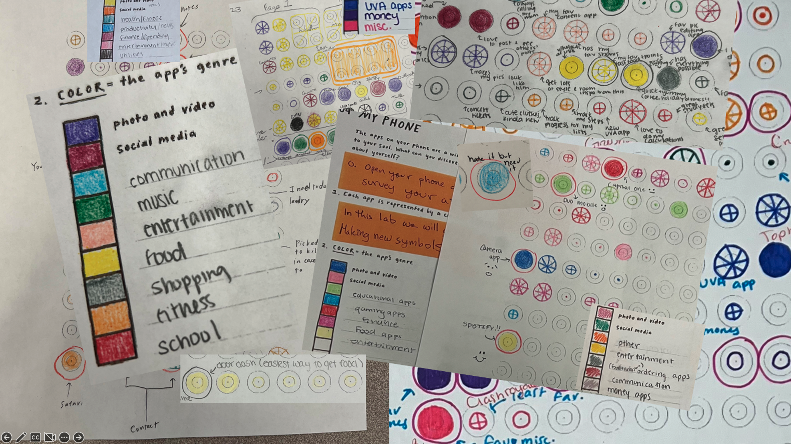

# DS 1001: Foundations of Data Science 

Your Foundations of Data Science Instructors:

    * Professors Brian Wright (bw2zd) and Peter Alonzi (lpa2a)
    * Class Location: Nau Hall 101
      * Lab: McLeod Hall 1003 or Monroe Hall 134

Professor Office Hours:
  * Alonzi: 14:00-15:30 on Tuesdays in Data Science 344
  * Wright: 1:30-3:30 on Mondays in Elson 165

<!--- Additional Course Materials: [www.definingdatascience.com](www.definingdatascience.com) --->

Subject Area and Catalog Number: Data Science, DS 1001

Year, Term and Time: 2024, Fall, 14:00-15:15 Mo & We

Class Title: Foundations of Data Science

Level: Undergraduate

Credit Type: Grade (A-F)

N.B.: There is an associated lab class that must be enrolled simultaneously (1 hour Laboratory section, Friday Mornings).

 

<!---  --->

## A Little Bit About the Course
This is a survey course about the emerging field of Data Science. The School of Data Science at UVA has pioneered a new approach to Data Science that goes beyond the analytical computational aspect of Data Science and also encompasses the human element necessary to achieve real and ethical effects in today's data-driven world. This course will focus on the fundamental concepts of each aspect of Data Science as expressed in the Virginia Model of Data Science ([link](https://arxiv.org/abs/2311.07631)).

### What Former Students Have Said

> I took this class to get my feet wet, learn more about what data science really was, learn how it was applied in the real world, and see if I would actually like it. I am happy to say that it has taught me a lot and I am extremely excited to continue studying data science in the future.

> Prior to this lab, I really had no idea about how hardware worked or what the name of anything was. However, I learned so much about the hardware of my Mac and iPhone, and I feel like it gave me a better appreciation for how my devices are constructed ot maximize efficiency.

> Once I accepted that the time was as good as spent, I felt surprisingly relieved and a lot more relaxed. Instead of living in the future my mind was occupied completely by the present.

> Humanizing data reminds me that data serves other people and that even numbers themselves represent other people and the world that we live in.

> This lab was extremely fun and interactive using the notebook to experience leveraging a GPU.

> I think was a good way to introduce the class on how to code and get our foot in the door. As this is a data science intro class, it was nice to be able to have an opportunity to learn a little bit about coding and makes me excited to try more in the future.

> I went into this case study simply hoping to learn a bit more about maps and how they are created. However, throughout this process, I have discovered much about how certain decisions about data are made at each step.

> You're not going to get it right the first time. That's ok! You have to learn from your mistakes in order to grow and find the best solution possible for the problem you are working on in the moment. 

## What you’ll learn along the way
We will spend the majority of the semester focusing on the major aspects of Data Science: Design, Value, Systems, and Analytics. We will finish the semester with time for putting these concepts into practice and understanding the Data Science pipeline. Each of these components has learning objectives detailed below but the highest level objective is that you will be able to:

* Prime Learning Objective: Define Data Science and explain it to friends and family // Be able to describe the field of Data Science and its emerging sub-fields
* Secondary Objective: Identify how you see yourself in the field

In each of the areas we will specifically focus on:
* Design
  * Theme: Storytelling -- What do I leave in and what do I leave out?
  * LO: Observe the world around you and record your observations in a systematic way (aka how to create a data set)
  * LO: Principles of Established Data Sets (aka how to evaluate a data set)
  * LO: Reflect on your data set and transform it into a medium for efficient communication with other humans (aka how to communicate a data set)

* Value
  * Theme: With great power comes great responsibility
  * LO: Be able to reflect on and articulate the benefits and concerns of data-driven decisions
  * LO: Describe scenarios that allow for human-centered data science

* Systems
  * Theme: Scaling -- What scale is necessary?
  * LO: Identify the hardware and software components of a computer and describe their function
  * LO: Describe the different scales of computer operation

* Analytics
  * Theme: Analyzing -- Garbage in, Garbage out
  * LO: Describe the ecosystem of data models 
  * LO: Articulate a typical algorithm life cycle 

The course will move rather quickly and can be demanding at times. However, if we all work together to support each other you’ll be amazed how much you learn at the end of the semester!

## How You’ll Know You Are Learning (Assignments)
Every graded assignment in this class falls into one of 5 categories outlined below. Each assignment has a rubric to indicate the purpose, task, and criteria for the assignment. They are graded using the specifications grading system. The details are [here](https://github.com/UVADS/DS1001/blob/main/grading.md), this is based on **Specifications Grading** By Linda Nilson. We will spend time in class to help you understand this system, especially if it is new for you.

The 5 assignment categories:
1. Labs - there is a lab section for this course and every student is expected to enroll and complete the lab assignments. The definition of "lab" is loose as the assignments performed in the lab sections vary. The goal is for all of this work to be completable within the class lab period.
2. "Read" and Review - every week supplemental material will be posted to enhance the in class activities. This is not just reading but can also include watching short videos. A short review of the key points is then submitted as the assignment deliverable.
3. Case Study Extensions - During the semesters case studies will be presented. This assignment type involves going beyond the initial parameter of the case study and exploring some of the more advanced points.
4. "Look ahead" - These assignments are designed to allow students to advance their mastery of topics further. The incorporate material from courses typically taken by 2nd and 3rd year students.
5. Final Essay - This assignment is the students' opportunity to synthesize the semester and show mastery of the primary learning objective "define data science". The higher bundles require a more complex essay which includes a discussion of personal career paths in data science and ultimately discussing next steps and the future of data science.

Bonus experimental category (not part of overall course grade):

This semester we are developing an additional assignment type and are looking for your help. Periodically we will present quiz style questions. Our goal is for them to serve as a good check so that you have another tool to assess how your learning is going. These will not be part of the overall grade.

## Tech Stack (Course Delivery Tools)
There are several technological tools used in this class:

* Email: Official communication from UVA is sent via UVA email
* Canvas: The official Learning Management System for this course is Canvas, all assignments are managed through canvas **including lab assignments**.
* Personal Computer: We will be doing coding in this class, your laptop does not need any special hardware or software for our work.

## Materials That Will Aid in Your Learning: 

* A. [Weapons of Math Destruction](https://www.amazon.com/Weapons-Math-Destruction-Increases-Inequality/dp/0553418815)
* B. [Observe, Collect, Draw! by Lupi and Posavec](https://www.amazon.com/Observe-Collect-Draw-Visual-Journal/dp/1616897147)
* C. [R for Data Science](https://r4ds.had.co.nz/)
* D. [Python for Data Analysis](https://www.amazon.com/Python-Data-Analysis-Wrangling-IPython-ebook/dp/B075X4LT6K)
* E. [How charts lie : getting smarter about visual information](https://www.amazon.com/How-Charts-Lie-Getting-Information/dp/1324001569)

## Schedule of Topics 

| Week  |   Section    |              Dates               |          Lecture          |             Lab              |
|:-----:|:------------:|:--------------------------------:|:-------------------------:|:----------------------------:|
|   1   |    Intro     | M X   W 8/28   F 8/30              |                           |              X               |
|   2   |    Design    | M 9/2   W 9/4   F 9/6              |                           |         LABS-1: LUPI         |
|   3   |    Design    | M 9/9   W 9/11   F 9/13            |   9/11 GL - MC Forelle    |         LABS-2: SET          |
|   4   |    Design    | M 9/16   W 9/18   F 9/20           | 9/16 GL – Carrie O’Brien  |     LABS-3: Projection!      |
|   5   |    Value     | M 9/23   W 9/25   F 9/27           |                           |     LABS-4: Guess Who!?      |
|   6   |     Value    | M 9/30   W 10/2   F 10/4           |                           |         LABS-5: GIGO         |
|   7   |     Value    | M 10/7   W 10/9   F 10/11          |                           |      LABS-6: Case Study      |
|   8   |   Systems    | M X (reading)   W 10/16   F 10/18  |                           | LABS-7: Hardware & Software  |
|   9   |    Systems   | M 10/21   W 10/23   F 10/25        |                           |      LABS-8: Battleship      |
|  10   |    Systems   | M 10/28   W 10/30   F 11/1         |                           |         LABS-9: GPU          |
|  11   |   Analytics  | M 11/4   W 11/6   F 11/8           |                           |     LABS-10: Probability     |
|  12   |   Analytics  | M 11/11   W 11/13   F 11/15        |                           |         LABS-11: kNN         |
|  13   |   Analytics  | M 11/18   W 11/20   F 11/22        |                           |   LABS-12: Decision Trees    |
|  14   |     Outro    | M 11/25   W X (thanks)   F X       |                           |              X               |
|  15   |     Outro    | M 12/2   W 12/4   F 12/6           |                           |        Lab Makeup Day        |

### Additional Dates
* 9/6 - This is the first lab day and also the first READ assignment is due.
* 12/6 - Lab makeup day
* 5/7 - Revise and Resubmission due date for assignments graded after 4/30

## A note about the "readings"
Every week there will be a "reading assignment". It will focus on one piece of media, not just written words, videos, podcasts, etc are all within bounds. However, the content is not decided before the term. The readings are selected as the course progresses to align with the course and the evolving world we live in. They will be posted with the assignment via Canvas.

## Guest Speakers

* Carrie O'Brien: User Interface Designer at Capital One: Messaging, Web, and Human-Centered Design
* Neal Magee: Director, Solutions & DevOps, UVA Research Computing
* Miriam Friedel: Senior Director, Machine Learning Engineering at Capital One - Center for Machine Learning

## A few Policies that will Govern the Class

Grading Policies: This course uses the specifications grading system as explained in **Specifications Grading** By Linda Nilson. For details [see this page](grading.md).

University of Virginia Honor System: All work should be pledged in the spirit of the Honor System at the University of Virginia. The instructor will indicate which assignments and activities are to be done individually and which permit collaboration. The following pledge should be written out at the end of all quizzes, examinations, individual assignments, and papers:  “I pledge that I have neither given nor received help on this examination (quiz, assignment, etc.)”.  The pledge must be signed by the student. For more information, visit www.virginia.edu/honor.

Special Needs:  The University of Virginia accommodates students with disabilities. Any SCPS student with a disability who needs accommodation (e.g., in arrangements for seating, extended time for examinations, or note-taking, etc.), should contact the Student Disability Access Center (SDAC) and provide them with appropriate medical or psychological documentation of his/her condition. Once accommodations are approved, just follow up with me concerning any logistics and implementation of accommodations.  Please try to make accommodations for test-taking at least 14 business days in advance of the date of the test(s). Students with disabilities are encouraged to contact the SDAC: 434-243-5180/Voice, 434-465-6579/Video Phone, 434-243-5188/Fax. Further policies and statements are available at www.virginia.edu/studenthealth/sdac/sdac.html

